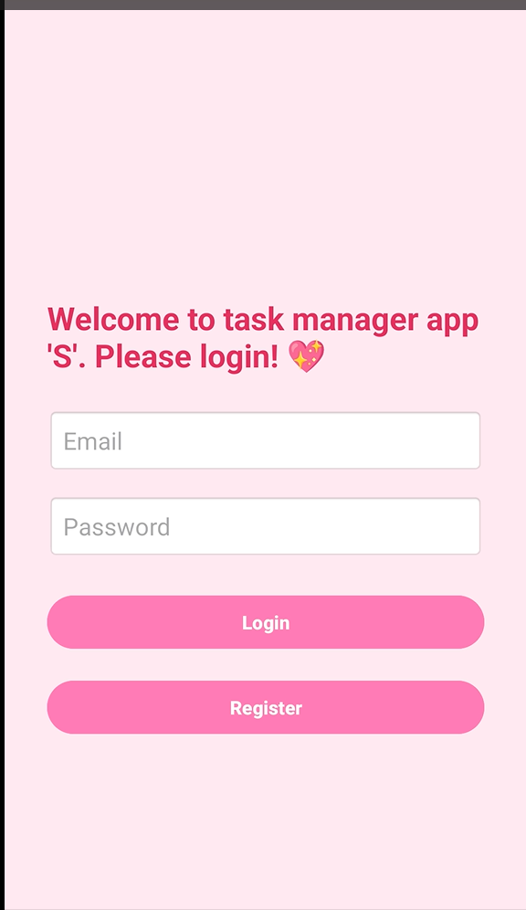
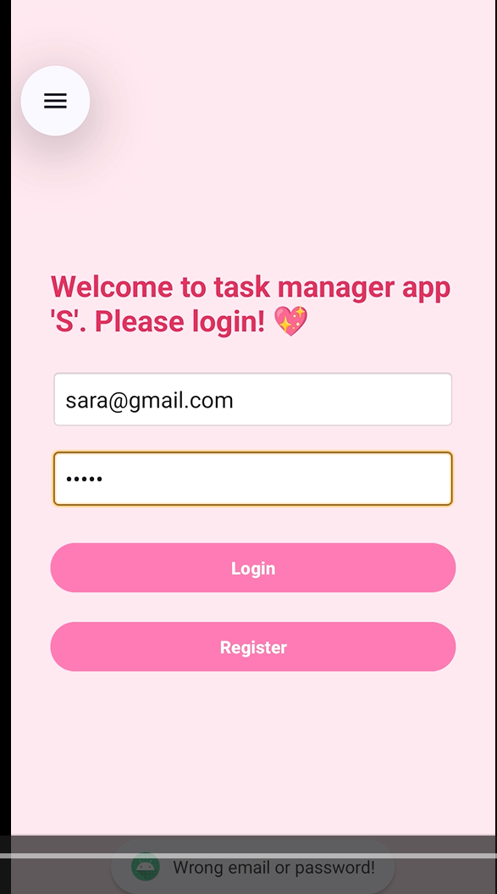
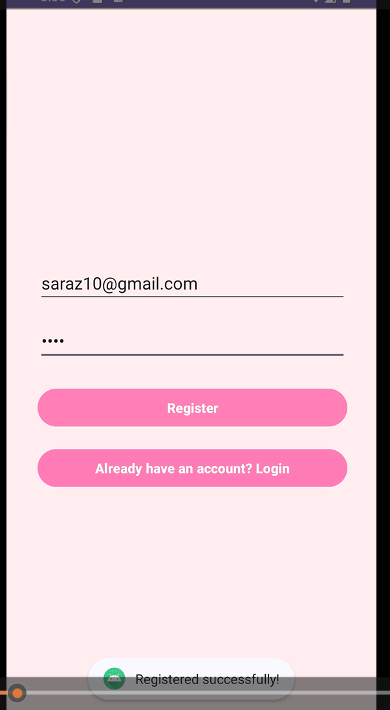
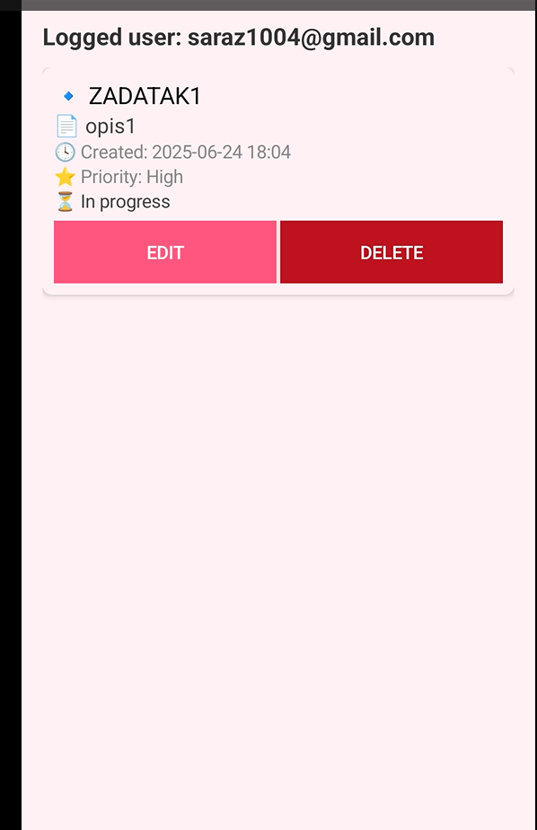
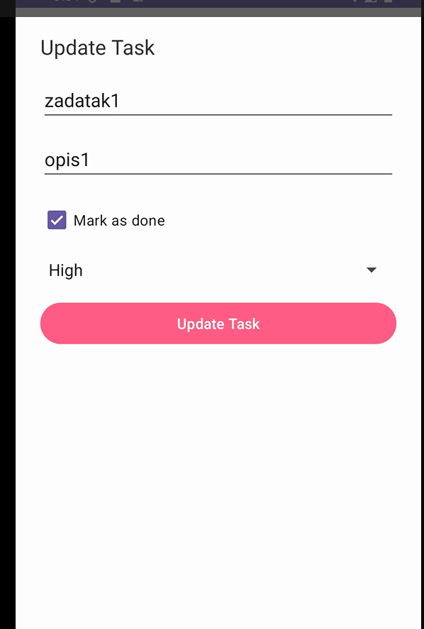
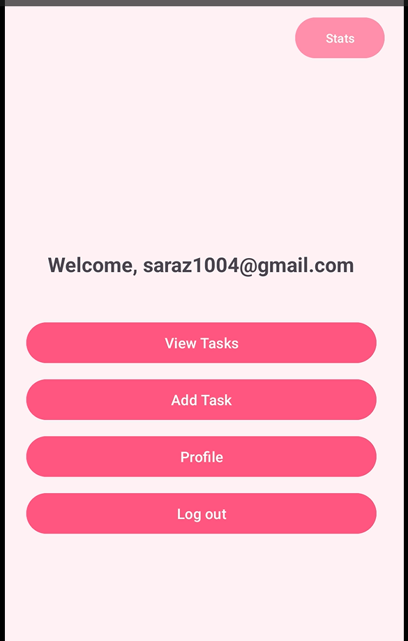
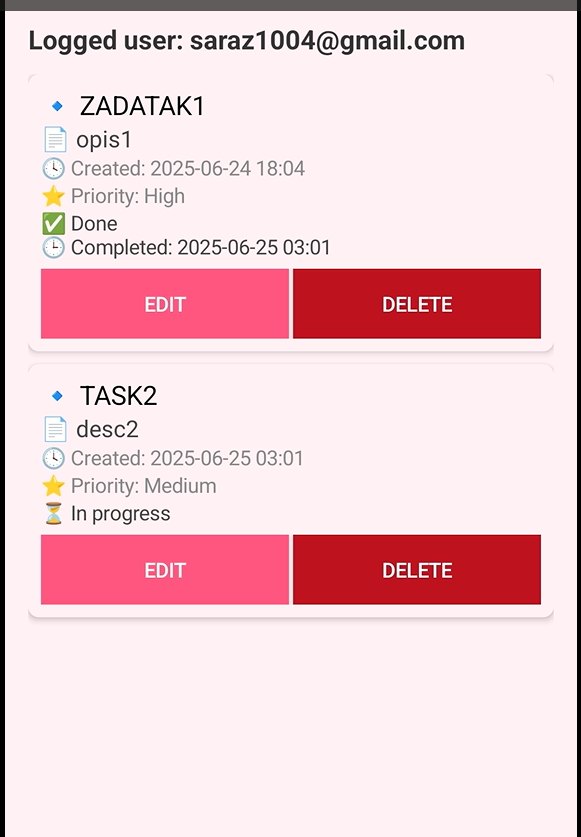
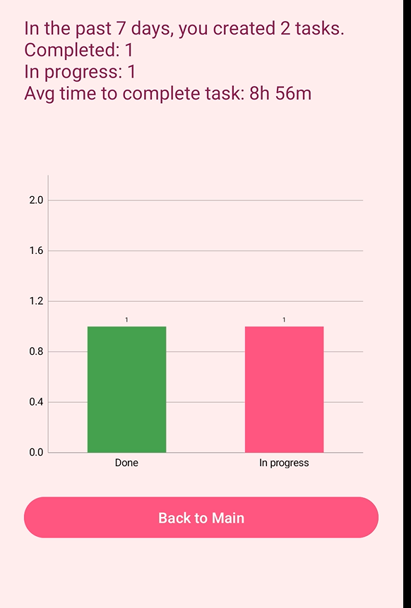

# Smart Task Manager Android App

Android task management application developed in Android Studio using Kotlin and SQLite.

## Features

- User registration and login system
- SQLite local database integration
- Create, update, and delete tasks
- Task priority management (High / Medium / Low)
- Task completion tracking
- Statistics dashboard with charts
- Average task completion time calculation
- User profile management
- Clean and modern mobile UI

## Technologies

- Kotlin
- Android Studio
- SQLite
- RecyclerView
- Android Activities
- Local Storage
- MPAndroidChart

## Screenshots

### Login Screen

### Login Validation

### Registration Screen

### Main Dashboard

### Task List

### Task List With Completed Tasks

### Update Task Screen

### Statistics Dashboard

## Application Functionality

The application allows users to:

- Register and securely log into the system
- Create personal tasks with priorities
- Track task completion status
- Edit or delete tasks
- View statistics about completed and pending tasks
- Calculate average task completion time
- Manage personal profile information

## Database

The project uses SQLite for local data persistence and stores:

- User accounts
- Task titles and descriptions
- Task priorities
- Task statuses
- Creation timestamps
- Completion timestamps

## Project Purpose

This project was developed as part of the Mobile Applications course and focuses on Android development, local database management, CRUD operations, statistics visualization, and modern mobile UI/UX design.

## Author

Sara Zivkovic
